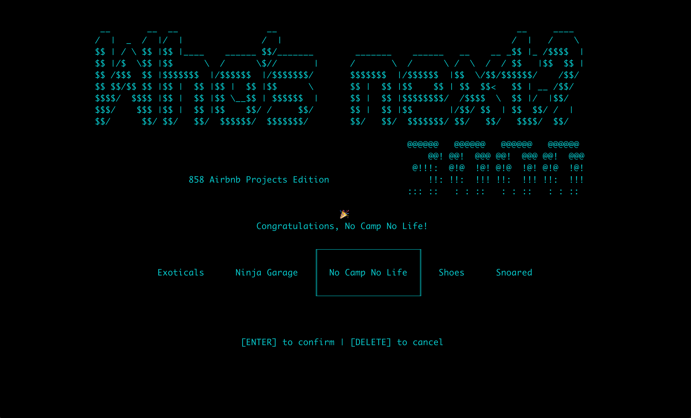

# Who's Next? 3000

A spinning wheel utility to randomly pick a candidate.

Basically the same as [@yannklein's Student Picker script](https://github.com/yannklein/student-picker), but 3000x better.

## Installation

```sh
pip install git+ssh://git@github.com/trouni/whosnext3000
```

## Usage

Available commands:

```sh
    whosnext3000                     Runs the utility
    whosnext3000 lists               Show all the lists
    whosnext3000 active              Select the active list
    whosnext3000 create              Create a new list
    whosnext3000 delete              Deletes a list
```

You can also directly edit the lists in the config file located at `~/.whosnext3000.yml`.

## Example

Create a list:
```
terminal [main] whosnext3000 create
Name of the list > 858 Airbnb Projects
Please enter the name of the candidates in the list.
Leave the name empty and press [ENTER] to finish creating the list.
Name of candidate #1 > Ninja Garage
Name of candidate #2 > No Camp No Life
Name of candidate #3 > Snoared
Name of candidate #4 > Exoticals
Name of candidate #5 > Shoes
Name of candidate #6 >
```

Run the app:
```
terminal [main] whosnext3000
```

